# GitHub 开发常用命令行速查

以下命令在 **Git Bash / PowerShell / CMD / WSL / macOS Terminal** 中均可使用（路径与引号在 Windows 上注意空格与中文路径）。

## 0. 你们团队的协作流程（与命令对应）

1. **克隆仓库**：得到完整历史，默认会检出远程默认分支（一般为 `main`）。
2. **基于最新 main 开个人分支**：在本地新建自己的分支名（建议带姓名或任务前缀，如 `zhangsan/fix-login`），所有修改只在该分支提交。
3. **开发 → `git add` / `git commit`**：多次提交均可，推送前可整理提交说明。
4. **`git push` 到 GitHub**：把个人分支推到 `origin`，**组员通常不直接 push `main`**。
5. **在 GitHub 上开 Pull Request（PR）**：源分支选你的个人分支，目标分支选 `main`，填写说明后提交合并请求。
6. **组长审查**：Code Review 通过后，由组长在 GitHub 上 **Merge** 进 `main`；合并后远程 `main` 已更新。

你本地后续要继续开发时：先 `git checkout main` → `git pull`，再 `git checkout -b` 新分支或从已有关联的个人分支继续（视团队约定而定）。

## 1. 首次：配置身份（每台机器一次）

```bash
git config --global user.name "你的名字"
git config --global user.email "你的邮箱@example.com"
```

查看配置：

```bash
git config --global --list
```

## 2. 克隆仓库

HTTPS：

```bash
git clone https://github.com/用户名/仓库名.git
```

进入目录：

```bash
cd 仓库名
```

确认在 **main**（或与团队约定的主分支名）并拉取最新，再开个人分支：

```bash
git checkout main
git pull origin main
```

## 3. 远程与同步

查看远程：

```bash
git remote -v
```

拉取远程更新（不合并，安全查看）：

```bash
git fetch origin
```

拉取并合并当前分支跟踪的远程分支：

```bash
git pull
```

指定远程与分支：

```bash
git pull origin main
```

## 4. 分支：查看、新建、切换

**查看当前所在分支**（多种等价写法）：

```bash
git branch
```

当前分支前有 `*`。只看当前分支名：

```bash
git branch --show-current
```

**新建并切换到新分支**（推荐一条命令）：

```bash
git checkout -b feature/描述
```

或 Git 2.23+：

```bash
git switch -c feature/描述
```

切换已有分支：

```bash
git checkout main
# 或
git switch main
```

删除本地分支（已合并）：

```bash
git branch -d feature/描述
```

强制删除：

```bash
git branch -D feature/描述
```

## 5. 工作区 → 暂存 → 提交

查看状态：

```bash
git status
```

**添加文件**（单个）：

```bash
git add 路径/文件.py
```

添加当前目录所有变更：

```bash
git add .
```

**提交**：

```bash
git commit -m "简短说明本次修改"
```

修改上一次提交说明（尚未 push 或团队允许时）：

```bash
git commit --amend -m "新的说明"
```

## 6. 推送到 GitHub（组员：推个人分支 + PR）

首次推送**你的个人分支**并设置上游（之后在同一分支上可直接 `git push`）：

```bash
git push -u origin 你的分支名
```

之后在同一分支上：

```bash
git push
```

然后在浏览器打开仓库页面，使用 **Compare & pull request**（或 **Pull requests → New pull request**），**base** 选 `main`，**compare** 选你的分支，创建 PR 供组长审查。

**组长在审查通过后**在 GitHub 上完成 Merge；若组长选择在本地合并，可能使用等价于 `git checkout main && git pull && git merge 你的分支名 && git push origin main` 的流程，这由组长执行，**不必作为组员常规步骤**。

远程默认分支若为 `master`，把上文中的 `main` 换成 `master` 即可。

## 7. 常见补充

查看提交历史：

```bash
git log --oneline --graph -20
```

查看与远程的差异（fetch 之后）：

```bash
git log HEAD..origin/main --oneline
```

暂存工作区（临时切换分支用）：

```bash
git stash push -m "说明"
git stash list
git stash pop
```

撤销未提交的暂存（保留文件修改）：

```bash
git restore --staged 文件或目录
```

丢弃未暂存的修改（危险，先确认）：

```bash
git restore 文件
```

## 8. 建议流程（与你们团队一致）

```mermaid
flowchart LR
  clone[git clone]
  mainSync[git checkout main 与 git pull]
  branch[git checkout -b 个人分支]
  work[本地修改]
  add[git add]
  commit[git commit]
  push[git push -u origin 个人分支]
  pr[GitHub 新建 PR 指向 main]
  review[组长审查]
  merge[组长 Merge 进 main]
  clone --> mainSync --> branch --> work --> add --> commit --> push --> pr --> review --> merge
```



组员职责到 **push + 创建 PR** 为止；**合并进 `main`** 在 GitHub 上由组长完成。
